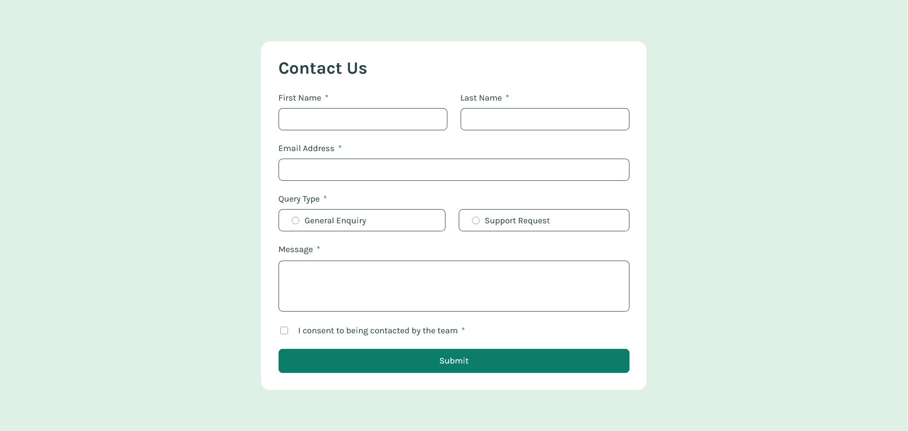

# Frontend Mentor - Contact form solution

This is a solution to the [Contact form challenge on Frontend Mentor](https://www.frontendmentor.io/challenges/contact-form--G-hYlqKJj). Frontend Mentor challenges help you improve your coding skills by building realistic projects.

## Table of contents

- [Overview](#overview)
  - [The challenge](#the-challenge)
  - [Screenshot](#screenshot)
  - [Links](#links)
- [My process](#my-process)
  - [Built with](#built-with)
  - [What I learned](#what-i-learned)
  - [Continued development](#continued-development)
  - [Useful resources](#useful-resources)
- [Author](#author)

## Overview

### The challenge

Users should be able to:

- Complete the form and see a success toast message upon successful submission
- Receive form validation messages if:
  - A required field has been missed
  - The email address is not formatted correctly
- Complete the form only using their keyboard
- Have inputs, error messages, and the success message announced on their screen reader
- View the optimal layout for the interface depending on their device's screen size
- See hover and focus states for all interactive elements on the page

### Screenshot

### Links

- Solution URL: [https://github.com/jpzs444/contact-form](https://github.com/jpzs444/contact-form)
- Live Site URL: [https://jpzs444.github.io/contact-form/](https://jpzs444.github.io/contact-form/)

## My process

### Built with

- Semantic HTML5 markup & ARIA attributes
- Sass/SCSS
- Flexbox
- Mobile-first workflow
- [React](https://reactjs.org/) - JS library
- [Vite](https://vite.dev/) - Build tool

### What I learned

- Using ARIA attributes (e.g., `aria-required`, `aria-hidden`, `aria-describedby`) and semantic HTML, as well as customizing the input fields' focus state for web accessibility
- Creating custom form validation to adhere to the design aesthetics provided by the Frontend Mentor challenge
- Implementing a custom-made toast component
- Reinforcing my knowledge with regular expressions and Sass

### Continued development

- Explore form libraries

### Useful resources

- [web.dev](https://web.dev/accessibility) - This helped me in understanding the best accessibility practices and keyboard navigation, most especially when dealing with forms.
- [A Guide To Accessible Form Validation](https://www.smashingmagazine.com/2023/02/guide-accessible-form-validation/) - This is an information-rich article which helped me choose the right ARIA attributes to my input fields. It also laid out examples of how a screen reader would interpret your code.

## Author

- Website - [Jose Paolo Indiongco](https://josepaoloindiongco.vercel.app/)
- Frontend Mentor - [@jpzs444](https://www.frontendmentor.io/profile/jpzs444)
- LinkedIn - [Jose Paolo Indiongco](https://www.linkedin.com/in/jpindiongco/)
